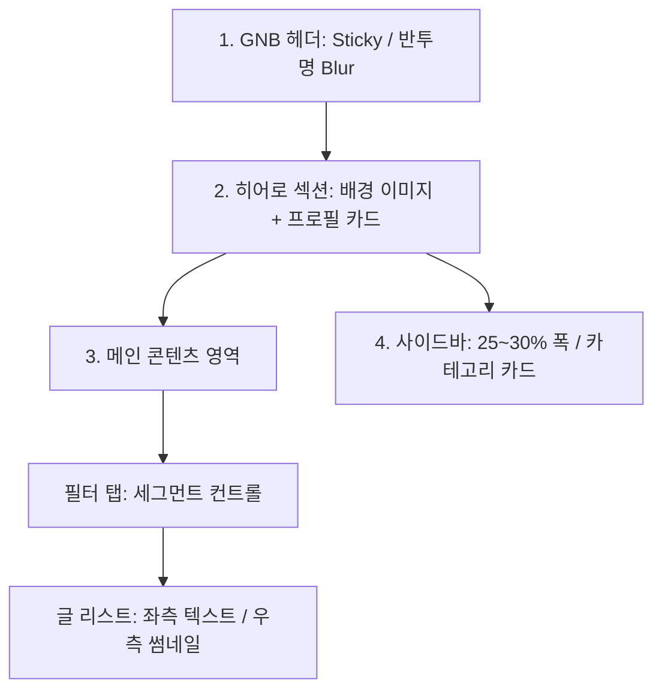

# 🖼️ 메인 페이지 와이어프레임 상세 명세

> **Concept:** 사용자가 제안한 스케치를 바탕으로 '애플/토스' 감성을 더한 세부 설계입니다. 반투명 레이어(Glassmorphism)와 쫀득한 마이크로 인터랙션을 지향합니다.

---

## 📐 레이아웃 시각화 (Mermaid)



## 🛠️ 컴포넌트별 세부 설계

### 1. 헤더 (Global Navigation Bar)

> [!info] **위치 및 스타일:** 최상단 고정 (Sticky) | 배경 반투명(`Blur 20px`) + 화이트/블랙 반전 텍스트

- **구성:**
    
    - `[좌측]` 블로그 명
        
    - `[우측]` 홈, 카테고리, 태그, 검색 아이콘
        
- **인터랙션:** 메뉴 아이템 호버 시 불투명도가 `100% ➡️ 70%`로 부드럽게 변화 (_Fade-out 효과_)
    

### 2. 히어로 섹션 (Branding Area)

- **배경:** 사용자 지정 배경 사진 (하얀색과 은색의 그라데이션)
    
        

### 3. 메인 콘텐츠 영역 (Main Content)

- **필터 탭:** '최신글', '인기글' 버튼 (_토스 스타일의 세그먼트 컨트롤_ 사용, 선택 시 배경색 변하며 활성화)
    
- **글 리스트 (Article List):** `[좌측] 텍스트 및 정보 영역` / `[우측] 썸네일 사진`
    

|**구분**|**세부 디자인 가이드라인**|
|---|---|
|**카테고리 칩**|둥근 모서리 칩 형태, 배경 `#F2F2F7`, 텍스트 크기 `0.8rem`|
|**날짜 메타**|카테고리 옆 배치, 연한 회색 `#A1A1A6`, 텍스트 크기 `0.75rem` (시선 분산 방지)|
|**텍스트 본문**|제목(`Bold 1.25rem`, 검정) + 요약(`Gray 500`, 2줄 제한 / `line-clamp: 2`)|
|**썸네일**|`120x120px` 정사각형, Rounded Corner (`16px`), `object-fit: cover`|

#### 3-1. 글 목록 헤더 구조 (수정)

- **"전체 글" 헤더:** 글 목록 최상단에 카테고리 이름(`분류 전체보기`) + 글 수(`N건`) 표시
  - 카테고리 페이지에서도 동일한 헤더 구조 적용
  - 헤더 하단의 블로그 설명 텍스트(`[##_list_description_##]`)는 홈 인덱스 페이지에서 미표시
  - 카테고리 커버 이미지(`[##_list_image_##]`)는 홈 인덱스 페이지에서 미표시

- **댓글/하트 수:** 각 글 카드 하단에 댓글 아이콘 + 댓글 수, 하트 아이콘 + 좋아요 수 표시
  - 홈 인덱스 페이지의 글 목록에도 정상 표시됨

### 4. 사이드바 (Sidebar)

- **위치:** 본문 우측 (전체 폭의 약 `25% ~ 30%` 차지)
    
- **구성:** 프로필 위젯, 카테고리 위젯 (전체 카테고리 목록을 그룹화하여 배치)
    
- **인터랙션:** 카테고리 항목 호버 시 배경색이 연하게(`#F2F2F7`) 변화

#### 4-1. 카테고리 위젯 선택 상태 (수정)

- **선택(Active) 탭:** 연한 파란 틴트 배경(`--color-accent-bg`) + 파란 텍스트(`--color-accent`) + `font-weight: 700`
  - 기존의 진한 파란 배경(`#007AFF`) + 흰 텍스트 방식에서 변경
- **하위 카테고리 계층:** 좌측에 `1.5px` 세로 구분선을 두어 트리 구조 시각화
- **카운트 배지:** 선택된 항목의 배지는 액센트 틴트 배경 + 파란 텍스트로 통일
    

---

## ⚡ 5. 마이크로 인터랙션 포인트 (Micro-interactions)

> [!success] **애플 특유의 쫀득한 반응성을 위한 인터랙션 공식**
> 
> 모든 변화는 `cubic-bezier(0.4, 0, 0.2, 1)` 곡선을 사용하여 **0.3초**간 부드럽게 실행합니다.

``` css
/* 글로벌 인터랙션 트랜지션 타이밍 */
transition: all 0.3s cubic-bezier(0.4, 0, 0.2, 1);
```

- **✨ 카드 리프트 (Card Lift)**
    
    - 리스트 아이템 호버 시 `transform: translateY(-4px)` 적용.
        
    - 동시에 그림자(Shadow)를 더 짙게 만들어 물리적인 깊이감(Depth) 부여.
        
- **🔎 썸네일 줌 (Thumbnail Zoom)**
    
    - 호버 시 썸네일 이미지만 내부에서 살짝 확대 (`transform: scale(1.1)`)되어 사용자 주목도 향상.