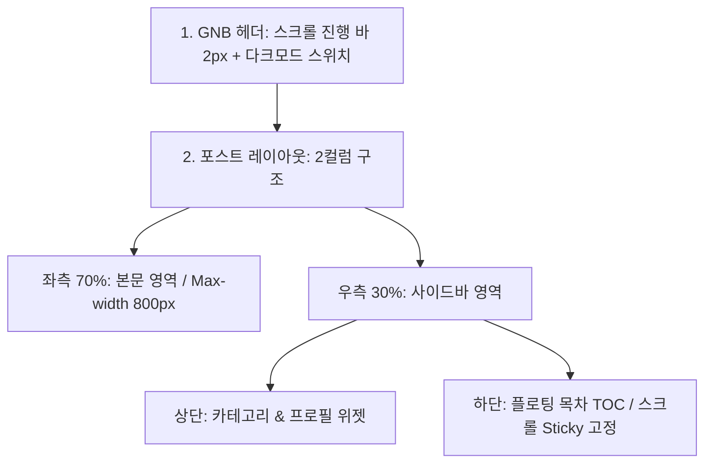

# 📝 상세 페이지(본문) 와이어프레임 상세 명세

> **Concept:** 사이드바의 기능성과 본문 몰입감을 동시에 잡은 2컬럼 기반 상세 설계입니다. 독자의 시선 흐름을 배려한 스크롤 인터랙션과 고해상도 위계 설계를 지향합니다.

---

## 📐 레이아웃 구조 시각화 (Mermaid)



## 🛠️ 컴포넌트별 세부 설계

### 1. 헤더 (Global Navigation Bar - Update)

- **🌗 다크모드 스위치:** * 우측 메뉴 끝에 배치 (토스 스타일의 토글 스위치 또는 애플 스타일의 해/달 아이콘).
    
    - 클릭 시 전체 UI 컬러셋이 즉시 전환되며, 부드러운 색상 전이 효과(`transition: 0.4s`)를 포함.
        
- **📏 스크롤 진행 바 (Reading Progress Bar):**
    
    - 헤더 바로 아래에 위치하는 `2px` 두께의 얇은 게이지 바.
        
    - 사용자의 본문 읽기 진척도(Scroll Percentage)를 계산하여 시각화.
        

### 2. 레이아웃 구조 (Post Layout)

- **✍️ 본문 영역 (좌측 70%)**
    
    - 텍스트 가독성을 최상으로 유지하기 위해 `max-width: 800px`로 제한.
        
    - 넉넉한 상하 패딩(Padding)을 적용하여 글 읽기 집중도 향상.
        
- **🧱 사이드바 영역 (우측 30%)**
    
    - **상단:** 메인 페이지에서 사용된 기존 카테고리 및 프로필 위젯을 동일하게 유지.
        
    - **하단 (Sticky):** 플로팅 목차(TOC) 영역 배치. 스크롤 시 사이드바 상단 요소가 화면에서 사라지면, 뷰포트 상단에 고정(`position: sticky; top: 80px;`)되어 따라옴.
        

### 3. 플로팅 목차 (Floating TOC)

- **디자인:**
    
    - 본문 헤더 타이틀(`H1`, `H2`, `H3`)을 추출하여 위계에 따라 계층형 들여쓰기(`margin-left`) 처리.
        
    - 폰트 크기는 작게(`0.85rem`), 색상은 연한 회색으로 처리하여 본문 가독성을 방해하지 않음.
        
- **인터랙션:**
    
    - **Scroll Spy:** 현재 사용자가 읽고 있는 위치의 목차 텍스트가 활성화되어 강조됨 (`Text-Color: 검정/흰색` + `왼쪽 2px 포인트 선`).
        
    - **Smooth Scroll:** 목차 링크 클릭 시 해당 섹션 위치로 부드럽게 스크롤 이동 (`scroll-behavior: smooth`).
        

### 4. 사이드바 유지 전략

- **연속성:** 메인 페이지의 카테고리 뷰를 본문 상세 페이지에서도 동일하게 노출함으로써, 사용자가 이탈하지 않고 언제든 다른 주제로 탐색할 수 있도록 유도.
    
- **여백 설계:** 본문 영역과 사이드바 사이의 간격(Grid Gap)을 최소 `40px` 이상 확보하여 시각적 답답함 해소.
    

---

## 🎨 상세 요소 스타일 (Global Elements)

|**요소 (Element)**|**스타일 및 인터랙션 가이드라인**|
|---|---|
|**인용구 / 코드블록**|메인 스타일 가이드와 동일하게 토스 스타일의 고대비 배경색 및 라운드 코너(`border-radius: 12px`) 적용|
|**날짜 / 카테고리**|포스트 제목 상단에 아주 작고 은은한 서체로 배치하여, 시선을 뺏지 않고 순수 정보만 전달|

```css
/* 플로팅 목차 활성화 상태 가이드 예시 */
.toc-item.active {
  color: var(--text-primary);
  border-left: 2px solid var(--accent-color);
  padding-left: 8px;
  font-weight: 500;
}
```
